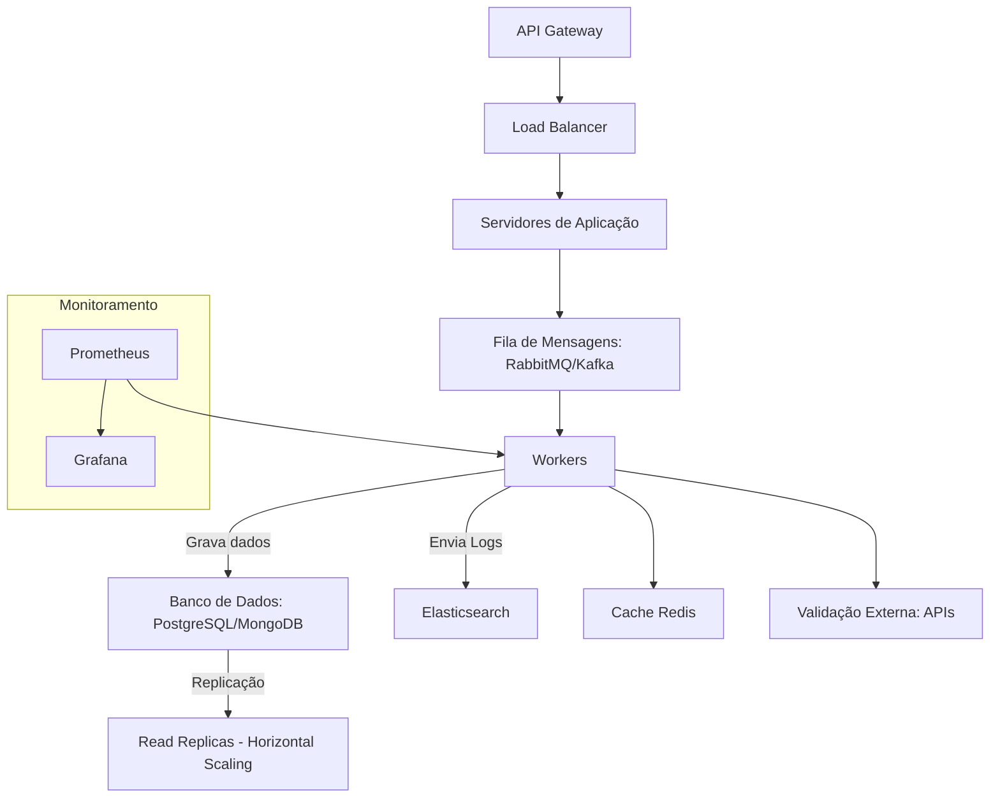

# Rascunho
Apenas uma rascunho para o design de sistema.

📌 Cenário
- O sistema processa milhares de transações por minuto.
- Cada transação precisa ser analisada em até 2 segundos.
- O sistema deve ser tolerante a falhas, com logs e rastreabilidade.
- A análise de risco pode incluir validações externas (ex: blacklist de CPF/CNPJ).

## Design de Sistema

Para o design deste sistema, consideraremos os seguintes componentes principais:
1. **Entrada de Dados**: Um serviço que recebe as transações.
2. **Processamento de Transações**: Um serviço que analisa as transações em paralelo.
3. **Validação Externa**: Um serviço que consulta APIs externas para validações.
4. **Armazenamento de Logs**: Um sistema para armazenar logs e rastreabilidade.
5. **Monitoramento e Alertas**: Um sistema para monitorar a saúde do sistema e enviar alertas em caso de falhas.

## Componentes do Sistema
### 1. Entrada de Dados
- **API Gateway**: Podemos usar o Amazon API Gateway ou o Kong. Isso centraliza o tráfego de entrada e permite autenticação, rate limiting e roteamento.
- **Load Balancer**: Um balanceador de carga (ex: Nginx, AWS ELB) para distribuir as requisições entre múltiplas instâncias do serviço
- **Fila de Mensagens**: Envia as transações para uma fila de mensagens (ex: RabbitMQ, Kafka) para desacoplar a entrada de dados do processamento.

### 2. Processamento de Transações
- **Workers**: Processos que consomem mensagens da fila e processam as transações.
- **Paralelismo**: Utiliza múltiplos workers para processar transações em paralelo, aumentando a capacidade de processamento.
- **Timeouts**: Implementa timeouts para garantir que as transações sejam processadas em até 2 segundos.
- **Load Balancer**: Utiliza um balanceador de carga para distribuir as transações entre os workers.
- **Cache**: Um cache (ex: Redis) para armazenar resultados de validações frequentes e reduzir latência.

### 3. Validação Externa
- **Serviço de Validação**: Um serviço que consulta APIs externas (ex: serviços de blacklist).
- **Timeouts e Retries**: Implementa timeouts e retries para garantir que as validações externas não bloqueiem o processamento.

### 4. Armazenamento de Logs
- **Banco de Dados de Logs**: Um banco de dados (ex: Elasticsearch) para armazenar logs de transações e rastreabilidade.
- **Formato de Log**: Utiliza um formato estruturado (ex: JSON) para facilitar a consulta e análise dos logs.

### 5. Monitoramento e Alertas
- **Sistema de Monitoramento**: Utiliza ferramentas como Prometheus e Grafana para monitorar métricas do sistema.
- **Alertas**: Configura alertas para eventos críticos (ex: falhas no processamento, latência alta).

## Considerações de Escalabilidade
- **Horizontal Scaling**: pode-se usar escalabilidade horizontal para adicionar mais instâncias de workers conforme a carga aumenta.
- **Auto Scaling**: Configurar auto scaling para aumentar ou diminuir o número de workers com base na carga de trabalho.
- **Partitioning**: Se necessário, particionar a fila de mensagens para distribuir a carga entre diferentes filas, permitindo que diferentes grupos de workers processem transações específicas.

## Resiliência e Tolerância a Falhas
- **Retries**: Implementar lógica de retries para transações que falharem temporariamente.
- **Circuit Breaker**: Utilizar o padrão Circuit Breaker para evitar sobrecarga em serviços externos.
- **Fallback**: Implementar mecanismos de fallback para garantir que o sistema continue funcionando mesmo se uma parte falhar.
- **Backup e Recuperação**: Ter um plano de backup e recuperação para o banco de dados, garantindo que os dados possam ser restaurados em caso de falha.

## Segurança
- **Autenticação e Autorização**: Implementar autenticação (ex: OAuth2) e autorização para proteger as APIs.
- **Criptografia**: Utilizar criptografia para dados sensíveis, tanto em trânsito quanto em repouso.
- **Auditoria**: Implementar auditoria para rastrear acessos e alterações no sistema.

## Acesso massivo ao Banco de Dados
- **Pooling de Conexões**: Utilizar pooling de conexões para gerenciar conexões com o banco de dados de forma eficiente.
- **Read Replicas**: Configurar réplicas de leitura para distribuir a carga de leitura do banco de dados.
- **Indexação**: Utilizar indexação adequada para melhorar a performance das consultas no banco de dados.
- **Cacheamento de Consultas**: Implementar cache de consultas frequentes para reduzir a carga no banco de dados.

## Justificativa da Arquitetura
Seguindo as recomendações da comunidade e as melhores práticas vistas em sistemas como Netflix, Amazon e Google.
Esse modelo de arquitetura foi pensado para ser escalável, resiliente e capaz de lidar com altas cargas de transações.
As Tecnologias e os padrões escolhidos sao bem conhecidos e amplamente utilizados, garantindo suporte e comunidade ativa.

### Tecnologias Sugeridas
- **API Gateway**: Amazon API Gateway ou Kong.
- **Fila de Mensagens**: RabbitMQ ou Kafka ou Redis.
- **Workers**: Kotlin, Go, ou PHP para processamento de transações.
- **Cache**: Redis para armazenamento de resultados de validações frequentes.
- **Banco de Dados**: PostgreSQL ou MongoDB para armazenamento de transações.
- **Balanceador de Carga**: Nginx ou AWS ELB para distribuir a carga entre os serviços.
- **Banco de Dados de Logs**: Elasticsearch para armazenamento e consulta de logs.
- **Monitoramento**: Prometheus e Grafana para monitoramento e alertas.
- **Linguagem de Programação**: Kotlin, Go ou PHP para desenvolvimento dos serviços.
- **Frameworks**: Spring Boot (Kotlin), Gin (Go) ou Laravel (PHP) para construção dos serviços.
